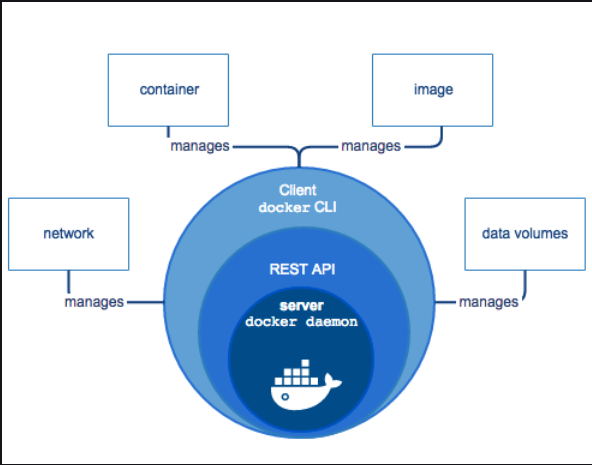
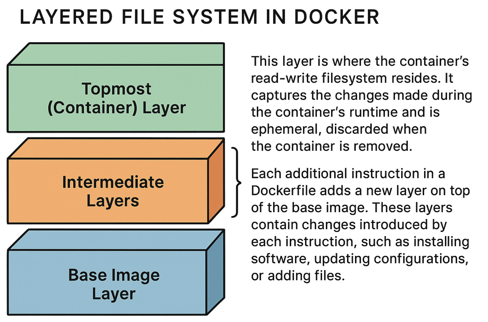

<h1 style="text-align:center;"> Docker </h1>

## What is Docker?

Docker is an open-source container platform that allows building, running, testing, and deploying applications quickly. It ensures that application would run in any environment.

## How does Docker work?

In Docker, a developer defines the entire application and its dependencies in a Dockerfile, which is then used to build Docker images out of which Docker containers are created further.

```
+-------------+              +-------+              +-----------+
| Docker File |  -- run -->  | Image |  -- run -->  | Container |
+-------------+              +-------+              +-----------+
```

### Important Points about Docker

- Developed in March, 2013 using Go Language.
- Docker uses container on the host OS. It performs OS-level virtualization known as containerization.
- It uses the kernel of the host OS rather than creating a whole virtual OS. This is one of the differentiating reason from virtualization.
- Docker can be installed on any OS, but the docker engine runs natively on the Linux Distribution.
- Docker is set of PaaS (Platform as a Service).
- Docker container does not have its own IP.

### Advantages of using Docker

- No pre-allocated RAM.
- Cost efficient, and light weight.
- An image can be used by multiple users at multiple processes.
- Takes very less time to create container.

### Limitations of Docker

- No solution for data recovery and data backup.
- Does not support cross platform compatibility but there are solutions for it.
- Not a good solution for the softwares that requires rich GUI. (Good for CLI-based applications).
- Sometimes, it becomes hard to manage large amount of containers.

### Usage of Docker

- Microservices
- Data Processing
- Continuous Integration and Delivery
- Containers as a Service

## Containerization

Docker utilizes the concept of containerization, which is an efficient method for deploying applications. Containers encapsulate applications with their own operating environments, unlike virtual machines (VMs) that create separate operating systems on top of the host OS.

VMs rely on hardware virtualization, whereas containerization utilizes OS virtualization. Therefore, containerization is a lightweight approach to virtualization.

## Architecture of Docker

Docker operates with a client-server architecture, enabling users to build, distribute, and run containerized applications efficiently. Its main components and their roles:

### 1. Docker Client

- The Docker Client (typically the CLI tool, `docker`) is the main way users interact with Docker.
- It takes user commands (such as `docker run`, `docker build`) and translates them into API requests, which it sends to the Docker Daemon.
- The Docker Client can interface with daemons running either on the local machine or remotely over a network.

```
+------+                   +-------------------------+               +----------------+
| User |  -- commands -->  |  Docker Client (docker) |  -- APIs -->  | Docker Daemons |
+------+                   +-------------------------+               +----------------+  
```

### 2. Docker Daemon (`dockerd`)

- The Docker Daemon (`dockerd`) is a background service running on the host machine.
- It listens for API requests from the Docker Client and is responsible for building, running, and managing Docker containers, images, networks, and storage volumes.
- The daemon can communicate with other Docker daemons to orchestrate containers across multiple hosts (for example, in a Docker Swarm cluster).
- It internally uses **`containerd`**, a core container runtime, to manage container lifecycle and execution using lower-level Linux primitives.

### 3. Docker REST API

The Docker REST API sits between the client and daemon and allows programmatic access to all Docker functionality, enabling automation and third-party integrations.

### 4. `containerd` and `runc`

The `containerd` is a lightweight, industry-standard container runtime that helps manage container lifecycle (start, stop, pull images, etc.). Docker relies on `containerd` for this functionality.

`runc` is the lower-level runtime (called by the `containerd`). It is responsible for actually creating applications’ containers by working directly with OS-level features like namespaces and cgroups.

### 5. Docker Registry or Hub

- A Docker Registry is a repository for Docker images, allowing users to store, share, and distribute container images.
- The most common public registry is Docker Hub, but private registries are also widely used in organizations.

### 6. Docker Objects

- **Images**: Read-only templates with an application and its dependencies. They form the blueprint for launching containers.
- **Containers**: Running instances of images, isolated from the host and each other.
- **Volumes**: Persistent storage for containers, decoupled from the container’s lifecycle.

### 7. Docker Desktop

Docker Desktop is an integrated application for Windows and Mac (and now some Linux distros) that packages the Docker daemon, CLI, Kubernetes, and some GUI tools into an easy-to-use development environment, often via a VM on non-Linux hosts.

### 8. Docker Compose

It is a tool for defining and running multi-container Docker applications. It allows specifying a set of containers, their configurations, and how they interact with each other using a simple `YAML` file. 

### How all works together?

1. A user sends a command to the Docker Client (CLI).
2. The docker client converts the command into an API call and communicates with the Docker Daemon via the REST API.
3. The daemon pulls images from a registry if required, builds new images, or starts containers.
4. Internally, the daemon relies on containerd and runc for precise container execution.
5. The daemon manages networking, storage, and inter-container communication.
6. Results (output or errors) are returned to the user’s CLI.



## Important Docker Terminologies

### Dockerfile

It contains the steps to create a Docker image (list of required software and dependencies). These images can be pulled to create containers in any environment. These images can also be stored online at Docker Hubs. When you run a Docker image, you get Docker containers.

### Docker Image 

It is a read-only file that defines a Docker container (instruction to make container). It is similar to the snapshot of a VM. Docker Images are run to create Docker containers. The images are immutable. So, the files making up an image do not change. These images can be stored locally or in remote locations.

- A docker image can be a collection of images (this is called **layering**).
- The format `name:version` is commonly used for image tagging in Docker.

### Containers

A container is a runnable instance of an image, basically the place where the application is running. Every container has a unique ID. Containers can be managed using the Docker API or CLI. A container can be connected to one or more networks, attach storage to it, or even create a new image based on its current state. 

The container does not communicate with the outside world. So, the container contains small version of OS and the dependency files that is needed to run the application. 

Containers follow **layered file system**:

1. **Base Image Layer**: The base layer is the initial layer of the filesystem and contains the core operating system files. It represents the root filesystem of the operating system that the container is based on. This layer is usually an existing image, such as an official Linux distribution or a custom base image.

2. **Intermediate Layers**: Each additional instruction in a Dockerfile adds a new layer on top of the base image. These layers contain changes introduced by each instruction, such as installing software, updating configurations, or adding files. Each layer is read-only and represents a specific state of the file system.

3. **Topmost (Container) Layer**: This layer is where the container's read-write filesystem resides. It captures the changes made during the container's runtime, such as modifications to files or the creation of new files. This layer is **ephemeral** and is discarded when the container is removed.



#### Benefits of Layered file system

- Since layers are read-only and can be shared among multiple containers, it minimizes the disk space used. If multiple containers use the same base image, the base image layer is shared, saving storage space.
- When an updated image is pulled, only the changed layers need to be downloaded, making the process faster. Similarly, during the build process, Docker can reuse cached intermediate layers, accelerating subsequent builds.
- Each layer is identified by a unique hash, making it easy to version and rollback changes. If a change is made to an image, only the affected layer needs to be updated.

### Docker Orchestration

Docker Orchestration is the management of multiple Docker containers, automating their deployment, scaling, and coordination to work together seamlessly, ensuring efficient and reliable operation of containerized applications. For example, think of Docker containers as individual building blocks that contain different parts of the application. Docker Orchestration is like the conductor that brings these building blocks together and ensures they work in sync.


## Docker Networking

Docker uses network drivers to define how containers communicate with each other, with the host, and with external systems. 

The main network types:

### Bridge (default)

- It is the default network for containers on a single host.
- Containers on the same bridge can talk to each other.
- For external access, the port (via `-p`) port mapping can be used.
- **User-defined bridge** networks (custom bridge) can be used for better isolation and built-in DNS-based service discovery.

### Host

- Container shares the host’s network stack (same IP as host).
- There is no isolation from host network, but less overhead and better performance.
- It is useful when the container needs direct access to host network.

### None

- Container is isolated with no network connectivity (except loopback).
- It is used for security or when there is a need to fully manage networking.

### Overlay

- It is the virtual network that spans multiple Docker hosts.
- It lets containers on different machines communicate as if on the same network.
- It is commonly used with Docker Swarm for multi-host, distributed applications.

### Macvlan

- It assigns each container its own MAC address on the physical network.
- Containers look like separate physical machines on the LAN with their own IPs.
- It is good for legacy apps or cases needing direct L2 presence on the network.

### IPvlan

- It is similar to Macvlan but focuses on IP-level routing with shared MAC.
- It is better for high-density environments and networks with MAC address limits.

### User-Defined Bridge (Custom Bridge)

- It is a bridge network created by the user (for example, `docker network create my-net`).
- It provides better isolation and built-in name resolution between containers.
- It is recommended for multi-container apps on a single host instead of the default `bridge`.

> **Note**: Docker also supports third-party network plugins for advanced use cases (for example, Weave, Calico, etc.).

## Docker Volumes

Docker volumes are the preferred way to persist and share data for containers. They are managed by Docker and live outside the container’s writable layer, so data survives container deletion and can be reused by other containers.

### Types of Storage

- **Named Volumes**:
  - It is managed by Docker and can be identified by a name.
  - It is stored under Docker’s internal data directory.
  - It is good for databases and persistent application data.
  - Example:
    - Create: `docker volume create my-data`
    - Use: `docker run -v my-data:/var/lib/data my-image`

- **Anonymous Volumes**:
  - There is no explicit name as it is generated by Docker.
  - It is created automatically when a volume is mounted without a name.
  - It is harder to manage and reuse and it is mostly used for temporary data.
  - Example: `docker run -v /data my-image`

- **Bind Mounts**:
  - It maps a host path to a path inside the container.
  - The changes are visible both on host and in container.
  - It is useful for development (mount source code) or sharing config/logs.
  - Example: `docker run -v /home/user/app:/app my-image`

- **tmpfs Mounts (Linux)**:
  - The data is stored in memory only (not on disk). So, data gets lost when container stops.
  - Example: `docker run --tmpfs /app/cache my-image`


## Docker File Creation

### Key Points

#### 1. File Name

- Must be named exactly: **`Dockerfile`**
- No extension like `.txt` or `.dockerfile`.

#### 2. Basic Structure of a Dockerfile

```Dockerfile
FROM ubuntu                           # Base image
LABEL maintainer="<email>"
RUN apt-get update                    # Commands executed while building the image
COPY . /app                           # Copy local files into the image
WORKDIR /app                          # Set working directory
CMD ["echo", "Hello from Docker!"]    # Default command when container starts
```

### Important Dockerfile instructions

#### `FROM`

- It is a mandatory filed.
- It specifies the base image (for example, `python:3.10`, `node:18`, `ubuntu`).

#### `LABEL`

- It holds the metadata such as maintainer info.

#### `RUN`

- It is used to specify the commands that run **during image build**.
- It can be used to install dependencies, update packages, etc.

#### `COPY`

- To copy files/directories from host to the image.

#### `ADD`

- It is like `COPY`, but also supports:
  - Downloading from URL
  - Auto-extracting archives

> **Note**: Should use `COPY` unless `ADD` is truly needed.

#### `WORKDIR`

- It sets the working directory for following instructions.

#### `EXPOSE`

- It documents the port the container listens on.

#### `ENV`

- It is used to set environment variables.

#### `CMD`

- It is the default command for the container.
- There is only **one CMD** per Dockerfile (last one wins).
- The commands should be in JSON array format:

  ```Dockerfile
  CMD ["python", "app.py"]
  ```

#### `ENTRYPOINT`

- It defines the main executable.
- It is often used together with CMD.
- It always runs, no matter what arguments are passed.
- It is best used when container needs to behave like a single-purpose executable.

### Example (Python app)

```Dockerfile
FROM python:3.10
WORKDIR /app
COPY . .
RUN pip install -r requirements.txt
CMD ["python", "main.py"]
```

## Docker Compose

Docker Compose is a tool that allows defining and running multi-container applications using a single YAML file called `docker-compose.yml`.

It helps in managing multiple services (web, database, cache, etc.) with simple commands.

- It helps to run multiple services with one command (`docker compose up`).
- It simplifies the configuration in a single YAML file by automatically handling:
  - Networks
  - Volumes
  - Environment variables
  - Service dependencies
  - Keeping the entire setup portable and reproducible

### Docker Compose File: `docker-compose.yml`

A Docker Compose file is written in YAML and describes one or more services.

#### Common Docker Compose sections

##### `services`

It defines all containers that the app needs.

##### `image`

It defines the existing image to be used in the container.

```yaml
image: nginx:latest
```

##### `build`

It is used to build an image from a Dockerfile.

```yaml
build: .
```

##### `ports`

It is used to map host ports to the container ports.

```yaml
ports:
  - "8080:80"
```

##### `volumes`

It is used to mount files/directories.

```yaml
volumes:
  - ./data:/var/lib/mysql
```

##### `environment`

It is used to set the environment variables.

```yaml
environment:
  - MYSQL_ROOT_PASSWORD=admin123
```

##### `depends_on`

It is used to define service dependencies.

```yaml
depends_on:
  - db
```

> **Note**: The `db` service must start before the current service.

##### `networks`

It is used to define custom networks (optional).

```yaml
networks:
  backend:
```

##### `restart`

It is used to define the restart policy.

```yaml
restart: always
```

### Example

```yaml
version: "3.8"

services:
  # -------------------------------
  # NGINX Web Server
  # -------------------------------
  web:
    container_name: nginx-server         # Correct key is container_name
    image: nginx                         # Using official NGINX image
    ports:
      - "8080:80"                        # Host:Container port mapping
    networks:
      - application-network              # Connects nginx to app network
    restart: always                      # Auto-restart for stability

  # -------------------------------
  # Redis Cache
  # -------------------------------
  redis:
    container_name: redis
    image: redis                          # Official Redis image
    networks:
      - application-network               # Flask can reach Redis
    restart: always

  # -------------------------------
  # MySQL Database
  # -------------------------------
  mysql:
    container_name: mysql-db
    image: mysql
    environment:                          
      MYSQL_DATABASE: "devops"
      MYSQL_ROOT_PASSWORD: "root"
    ports:
      - "3306:3306"
    volumes:
      - mysql-data:/var/lib/mysql         
    networks:
      - application-network
    restart: always

  # -------------------------------
  # Flask Backend
  # -------------------------------
  flask:
    build:
      context: .                          # Build local Dockerfile
    container_name: flask-backend
    ports:
      - "5000:5000"
    depends_on:
      - mysql                             # Flask waits for MySQL
    networks:
      - application-network
    restart: always

# -------------------------------
# Persistent Volume for MySQL
# -------------------------------
volumes:
  mysql-data:

# -------------------------------
# Application Network
# -------------------------------
networks:
  application-network:
```

## Extra

### Difference between `docker attach` and `docker exec`

The `exec` command creates a new process in the container's environment but `attach` command connects the standard I/O of the main process inside the container to the corresponding standard I/Oof the current terminal.

### Difference between `expose` and `publish`

- If we do not specify the `expose` or `-p`, then the services in the container can only be accessible from inside container.
- If we `expose` a port then the services in the container can be accessed by docker containers but it cannot be accessed by outside world.
- If we `publish` a port then the container services automatically gets exposed and it is accessible by everyone.

## Commands

### Basic Commands

#### To check if docker service is running or not:

```
service docker status
```

#### To start docker service:

```
service docker start
```

#### To get logs:

```
docker logs
```

### Images Commands

#### To run an image:

```
docker run <image-name>
```

- When run, every time a new container gets spined up.
- This command is a combination of: pulling the image and then spinning a container.
  
> **Note**: A port can also be specified to run a container using `-p` flag. For example: `-p 8080:80 nginx` (`<host-port> : <container-port>`)

#### To run an image in background or in detach mode (with `-d` flag):

```
docker run -d <image-name>
```

#### To get details of image/container:

```
docker inspect <image-name>
docker inspect <container-ID>
```

#### To check all the locally downloaded images:

```
docker images
``` 

- `-q` flag to get the image ID only. It flag resembles quiet.

#### To search images in the docker hub:

```
docker search <image-name>
``` 

#### To download an image from hub:

```
docker pull <image-name>
```

`:` is used to download the specific version. Example:

```
docker pull ubuntu:16.04
```

#### To remove the images:

```
docker rmi <image-name> -f
```

To remove all the images, all the active image IDs can be provided with this command. For example:

```
docker rmi $(docker images -q)
```

- **`docker images -q`**: This part of the command lists only the IDs of all Docker images on thee system.

> **Note**: When a container is running, then its image will not be deleted.

#### To create docker image from Dockerfile:

```
docker build -t <image-name> .
```

The single dot (`.`) at the end of the command sets the build context to the current directory. This means that the build expects to find the Dockerfile in the current directory.

### Container Commands

#### To list down the containers:

```
docker container ls
```

#### To connect to a container:

```
docker attach <container-name>
```

It connects the local system's standard input, standard output, and standard error to a running Docker container.

#### To create a new container from the specified image:

```
docker run -it <image-name>
```

#### To access the specific shell inside the container:

```
docker exec -it <container-id> <shell-type>
```

A specific shell can also be attached to the container. For example, attaching a bash shell:

```
docker container exec -it 2fcba592fbb2 bash
```

> **Note**: 
> - To run the above command, the container must be running in the background.
> - This command runs a command interactively inside an existing and already running container, identified by its container ID or name. No new container is created; instead, a new process is started within the running container.

#### To stop a container:

```
docker stop <container-ID>
```

#### To check all the containers:

```
docker ps
```

- `-a` tag can be used to list all the containers (stopped and active ones).

#### To remove a container:

```
docker rm <container-ID>
```

#### To delete all the stopped containers:

```
docker prune -f
```

- `-f` flag resembles force delete.

#### To share a container (convert the container into an image):

```
docker commit -m "message" <container-ID> <image-name>
```

#### To check the differences between the container's current filesystem and its base image filesystem:

```
docker diff <container-name>
```

In output, Docker will display a list of file and directory paths with one of the following status indicators:
- **``A``**: **Added** - Indicates that a file or directory has been added in the container's filesystem.
- **``D``**: **Deleted** - Indicates that a file or directory has been deleted from the container's filesystem.
- **``C``**: **Changed** - Indicates that a file or directory has been changed within the container.
- **``R``**: **Renamed** - Indicates that a file or directory has been renamed within the container.
- **``E``**: An **error** occurred while trying to determine the change.

### Docker Networking Commands

#### To list all the networks:

```
docker network ls
```

#### To create a new network:

```
docker create network <network-name> -d <driver-type>
```

`-d` flag resembles driver.

Example:

```
docker create network test-network -d bridge
```

#### To set a network:

```
... --network <network-name> ...
```

or

```
... --net <network-name> ...
```

#### To get details about a network:

```
docker network inspect two-tier
```

### Docker Volume Commands

#### To list down all the volumes:

```
docker volume ls
```

#### To create a volume:

```
docker volume create <volume-name>
```

#### To check the details of the volume:

```
docker inspect <volume-name>
```

#### To remove a volume:

```
docker volume rm my-vol
```

#### To remove unused volume: 

```
docker volume prune
```

#### To attach or bind volumes to containers:

Using `-v` / `--volume` (short form):

- Named volume:
  - `docker run -v my-volume:/data my-image`
- Anonymous volume:
  - `docker run -v /data my-image`
- Bind mount:
  - `docker run -v /host/path:/data my-image`
- Read-only:
  - `docker run -v my-volume:/data:ro my-image`

Using `--mount` (long, explicit form):

- Named volume:
  - `docker run --mount type=volume,src=my-vol,dst=/data my-image`
- Anonymous volume:
  - `docker run --mount type=volume,dst=/data my-image`
- Bind mount:
  - `docker run --mount type=bind,src=/host/path,dst=/data my-image`
- Read-only:
  - `docker run --mount type=volume,src=my-vol,dst=/data,ro my-image`

#### To publish a Docker Image to Docker Hub

1. **Build or commit the Docker image**
   If creating an image from an existing container:

   ```bash
   docker commit <container-id-or-name> <image-name>
   ```

2. **Tag the image properly**
   Docker Hub uses the format: `dockerhub-username/image-name:tag`

   ```bash
   docker tag <image-name> <dockerhub-username>/<image-name>:latest
   ```

3. **Login to Docker Hub**

   ```bash
   docker login
   ```

4. **Push the image to Docker Hub**

   ```bash
   docker push <dockerhub-username>/<image-name>:latest
   ```

#### To create Docker images

Steps to Create a Docker Image

1. **Create a Dockerfile**
   The file must be named exactly `Dockerfile` (no extension).

   ```bash
   touch Dockerfile
   ```

2. **Write the content of the Dockerfile**
   Example:

   ```Dockerfile
   FROM ubuntu
   ...
   ...
   ```

3. **Build the Docker image**
   Use the `docker build` command:

   ```bash
   docker build -t <image-name>:<tag> <path-to-dockerfile-directory>
   ```

   - The `-t` flag is used to give the image a name and optional tag (version).

4. **Login to Docker Hub**
   Before pushing the image, authenticate using:

   ```bash
   docker login
   ```

   Enter your Docker Hub username and password.

5. **Push the Docker image to Docker Hub**

### Docker compose commands

#### To start all services:

```bash
docker compose up
```

To run in background:

```bash
docker compose up -d
```

#### To stop running services:

```bash
docker compose down
```

#### To view logs:

```bash
docker compose logs
```

#### To rebuild images:

```bash
docker compose build
```

#### To list containers in the compose project

```bash
docker compose ps
```