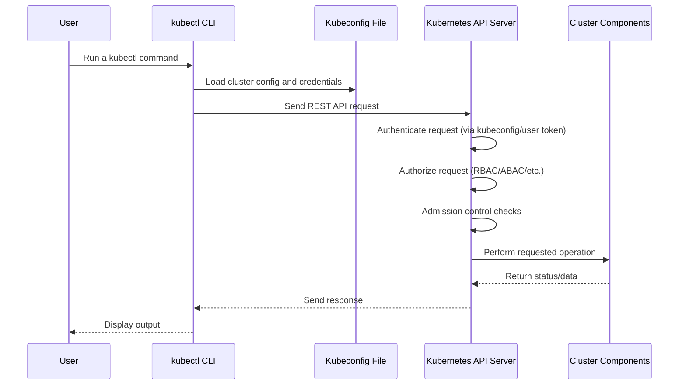

### kube-api server
- Component of kubernetes
- Heart of Kubernetes
- A service that acts as a communication gateway between various components
- Basically acts as a medium to communicate with cluster node components
- It is a cluster gateway and also acts as a gatekeeper
- It does authentication, verification 
- If we want to deploy a new application in kubernetes cluster, we interact with API server with help of a client (`kubelet` or an UI or kubernetes dashboard or CLI tool)

```
Any Request ---> API Server ---> Validates Request ---> Other Process
```

- There is only one entry point into the cluster (API Server) so it is safe
- It does:
    - authentication
    - authorization
    - 

### kube-scheduler
- Component of kubernetes
- Schedules the containers in the pods
- It checks the available resources and then schedules the pod deciding the most optimal node. It decides the node but the actual scheduling or starting of the pod with the desired container happens via (kubelet of the worker node)

```
Schedule New Pod ---> API Server ---> Scheduler ---> Where to put the Pod? ---> kubelet
```


### kube-controller manager
- Component of kubernetes
- It is combination of many controllers like node controller, deployment controller, namespace controller, etc.
- Checks if everything (every component) are working in sync correctly or not
- Detects state changes like pod die 

```
Change in State ---> Controller Manager ---> Scheduler ---> kubelet
```

### CCM or Cloud Controller Manager
- Manager if we are using Kubernetes on cloud like AWS, Azure, etc.


### etcd cluster
- It is not a part of kubernetes but it is the brain of the cluster which stores the state of the cluster
- It is a key-value store or database that stores all the information related to cluster nodes and master node
- It is highly reliable, secure, and it is benchmarked at 10000 writes per second.


### kubelet
- It must be installed on every node
- Its main work is to manage the pods on the worker nodes and interact with master node
- It is a process of kubernetes
- Works at worker nodes (pod level) and checks if everything is working fine or not and updates the detailed back to API server
- Interacts with both container runtime (container) and the node
- It starts the pod with containers inside the pod
- It uses port 10255 and always listens to api server
  

### Service Proxy or kube-proxy
- It must be installed on every node
- It has intelligent forwarding logic inside it which makes sure communication takes place in a performat way with low overhead
- It is a service that helps us to access pods (and containers) with the help of API server and kubelet
- It also provides networking, inter pod communication, IP addressing, load balancing, etc.
- It is deployed as a daemon-set on the node 
- It runs in kube-system namespace

### Pod
- It is a component of kubernetes
- It is the smallest unit in kubernetes that runs the container but we usually do not create or work with it, there is an abstraction layer over the pods called **deployment**. We create deployments and the deployment creates the pod underneath. The deployment has the blueprint to create the pod. There is also a layer of **replicaset** between the pod and the deployment.
- It can contain one or more containers
- It has no healing, no scalability 

> Name of the pod is a combination of: `deploymentName - replicaSetID - podID`

#### Working:
- Deployment manages replica set
- Replica set manager all the replicas of the pod
- Pod is an abstraction of the container

> Anything below the deployment is actually managed by the Kubernetes itself.

### CNI network
- Container Network Interface network which helps to communicate between master node and worker nodes

### Container runtime
- It is an independent process that actually runs the container

## kubectl (kube controller)
- It is a command line tool for kubernetes cluster. We can use it to interact with the kubernetes cluster. On our behalf, it interacts with the kube-api server and does our requested work.
- It can be used to interact with any type of kubernetes cluster (minikube, EKS, GKS, cloud, local, etc.)
- Acts as a controller from where we can extract all the information related to kubernetes


## `kubeconfig`
- A configuration file that tells the `kubectl` CLI **how to connect to a Kubernetes cluster**
- It includes details like:
  - **Cluster info** (API server endpoint)
  - **User credentials** (token, client certificate, etc.)
  - **Namespace** context
  - **Context** (a combination of cluster + user + namespace)

### Flow when we run `kubectl` commands
Overall Flow:


When a command is given from `kubectl` CLI. For example,
```bash
kubectl get pods
```

#### Work done by `kubectl` with the `kubeconfig`:
1. **Reads the file** (usually from `~/.kube/config`)
2. **Figures out**:
   - Which cluster to connect to
   - Which user credentials to use
   - Which namespace is the default
3. **Builds a REST API request** to the Kubernetes API Server using that info.

**Default Location**
```bash
~/.kube/config
```

## Services 
- It is just an abstraction not a process.
- Since Pods have dynamic IP addresses, Services provide a stable endpoint for accessing them.
- Service gets to know the pods to work with the help of selectors and ports.
- They are used to communicate between the nodes. Since pods can die easily, services help us to get:
  - Stable IP address
  - Loadbalancing
  - Loose coupling (what does this mean?)
- Types of services in kubernetes
  1. Default Service: It is default and internal service. It is also known as clusterIP service. Define using: `type: ClusterIP`
  2. Headless Service: In stateful applications, where we know which exact pod to connect. Client needs to figure out the IP address of each pod (using DNS lookup or API call to kubernetes server). Define using: `clusterIP: None`
  3. Multi-pod Service: Define using: ``
- Example structure of each services: 
- Various Services:
  1. `type: ClusterIP` means default service
  2. `type: NodePort` creates service accessible on static ports (fixed ports). It is not secure. It is an extension of ClusterIP. Port Range: 30000 t0 32767
  3. `type: LoadBalancer` creates service accessible externally for cloud platforms. It is an extension of NodePort.
  4. External names

> **Note**: To access a Pod or Service from your local machine without exposing it externally: 
> 1. **Service**: `kubectl port-forward svc/<service-name> <local-port>:<service-port>`
> 2. **Pod**: `kubectl port-forward pod/<pod-name> <local-port>:<pod-port>`
  
## Cloud Controller Manager
- CCM connects with cloud APIs.

## cri
- 


## kubectl
- It is a command line tool for kubernetes cluster. We can use it to interact with the kubernetes cluster. On our behalf, it interacts with the kube-api server and does our requested work.
- It can be used to interact with any type of kubernetes cluster (minikube, EKS, GKS, cloud, local, etc.)
  
## minikube
- It is a single pod setup on local machine meant for testing purpose
- It creates virtual box on the laptop and node runs on this virtual box
- It is basically running master node and worker node on a single node for testing on local system
- It is one node K8s cluster

## Terminologies
- Cluster
- Deployment
- Service (External, Internal)
- Elastic Stack

---

# START FROM HERE WITH CHAT_GPT

## Namespace
(default is the by default namespace. By default 4 namespaces present, why and when to use namespace)
- Which namespace holds what?
- Various namespaces can share services, etc.
- Volume and Nodes cannot be created within an namespace
- It should be same as service and pod name
- Use cases of namespace
- Important namespace commands
- Use `-n` flag to mention namespace
- not FQDN is used for communication between pods in two different namespaces
- Suppose we have 2 namespaces: n1 and n2. The pod from n1 can communicate (ping or curl) with the pod in n2 directly using IP address but the service of n1 cannot communicate with the service of n2. For their communication, we need to expose them and then access with hostname why?
  - This can be done if we use the fully qualified name instead of hostname. Example:
    ```bash
    curl [service-name].[namespace-name].service.cluster.local
    ```


## Kubernetes Storage and Volumes
- Kubernetes does not have storage out of the box. We configure it explicitly so if a pod dies then the new pod can start at same place
- Storage should not depend on the pod lifecycle
- Storage must be available to all nodes
- Storage needs to survive even if the cluster crashes
- Persistent Volume are out of namespace
- Components
  - Persistent Volume (pv)
    - It is a cluster resource and created using YAML file
    - It is a directory with some data which can be remote or local
    - In YAML, we mention the actual physical storage like local, nfs server, etc.
  - Persistent Volume Claim (pvc)
    - Pods requests volume through the pvc (pvc must exist in the same namespace as that of pod)
    - Claim tries to find a volume in cluster (that matches the specifications mentioned)
    - pv has the actual storage backend
    - Once the pv is found, the actual volume is mounted into the pod and then the volume can be mounted to the container
  - Storage Class (sc)
    - sc provisions persistent volumes dynamically when the pv claims it
    - It works in the same flow as pvc flow
- Various attributes of storage configuration YAML file

### Commands:
- To get available persistent volume: `kubectl get pv`
- To get available persistent volume claim: `kubectl get pvc`


## Ingress 
- An API object that manages external access to services inside a cluster, typically via HTTP/HTTPS. 
- Instead of using multiple **LoadBalancers** or **NodePorts**, Ingress efficiently routes traffic.
- To use Ingress, a **controller** must be deployed. There are multiple options:  
  - **NGINX Ingress Controller** – Most commonly used.  
  - **Traefik Ingress Controller** – Lightweight and dynamic.  
  - **HAProxy Ingress Controller** – High performance.  
  - **Cloud-specific Controllers** – GKE, EKS, AKS provide built-in controllers.  

### How Ingress Forwards Requests  
#### 1. Local or Non-Cloud Approach: 
Most commonly used in **Minikube, Kind, or bare-metal Kubernetes** deployments.  
*Traffic Flow:*
  ```markdown
  app-pod <-- app-internal-service <-- app-ingress <-- Ingress Controller Pod
  ```
  - The Ingress Controller Pod receives external requests.  
  - Routes traffic to the **Ingress resource** (rules define the routing).  
  - Forwards requests to **internal Services**, which route them to **Pods**.
  
#### 2. Cloud-Based Approach (AWS, GCP, Azure):
When running Kubernetes on **cloud platforms**, traffic is managed using **Cloud Load Balancers**.  
*Traffic Flow:*
  ```markdown
  app-pod <-- app-internal-service <-- app-ingress <-- Ingress Controller Pod <-- Cloud Load Balancer
  ```
- The **Cloud Load Balancer** receives traffic from the internet.  
- It directs traffic to the **Ingress Controller Pod**.  
- The **Ingress resource** applies routing rules.  
- Traffic is forwarded to **internal Services** and then to **Pods**.

### Default Backend in Ingress
A **default backend** is a Service that handles **unmatched requests** (i.e., requests that don’t match any Ingress rules).  
- Without a default backend, **unmatched requests result in a 404 error**.
- Typically, a **custom error page** or a **redirect** can be set up as a default backend.


## StatefulSet  
- Workload API object used for managing **stateful applications**. 
- StatefulSets ensure that each pod maintains a unique, persistent identity and stable network identifiers. 
- Primarily used for databases and applications requiring stable storage, such as PostgreSQL, MySQL, Cassandra, and Kafka.  
– Each pod in a StatefulSet gets a **persistent identity** (e.g., `pod-0`, `pod-1`), even if restarted.  
– Pods are created, updated, and deleted in **order** (`pod-0` starts before `pod-1`).  
– Uses **PersistentVolumeClaim (PVC)** to retain data, even when a pod restarts.  
– Provides a **stable network identity**, allowing direct pod-to-pod communication, also called headless service (`ClusterIP: None`)
- When to Use StatefulSets  
  - When running applications that **require stable network identity** and **persistent storage**.  
  - When deploying **databases** or **message brokers** where pod ordering and persistence are crucial.  
  - When an application requires **ordered scaling and termination** to ensure proper failover and data consistency.  

### Commands:
- List StatefulSets: `kubectl get statefulsets`
- List StatefulSets: `kubectl describe statefulset <statefulset-name>`
- Delete a StatefulSet (without deleting PVCs): `kubectl delete statefulset <statefulset-name> --cascade=orphan`
- Delete a StatefulSet (with deleting PVCs): 
  ```bash
  kubectl delete statefulset <statefulset-name>
  kubectl delete pvc -l app=example
  ```
- Scale a StatefulSet: `kubectl scale statefulset <statefulset-name> --replicas=5`


## ConfigMaps
- Used to **store and manage configuration data** separately from application code. 
- We can inject configurations dynamically into pods using environment variables or mounted volumes.  
- Allows easy configuration changes without modifying the containerized application.  
– Stores environment-specific configurations separately from container images.  
- Use ConfigMaps to dynamically inject values instead of embedding them in application code
– One ConfigMap can be used by multiple applications or services.  

### Commands: 
- List ConfigMaps: `kubectl get configmaps`
- Describe a ConfigMap: `kubectl describe configmap <name>`
- Delete a ConfigMap: `kubectl delete configmap <name>`
- Create a ConfigMap from a File: `kubectl create configmap app-config --from-file=<file-name>` 
- Create a ConfigMap from Literal Values: `kubectl create configmap app-config --from-literal=database_url="mysql://db:3306" --from-literal=log_level="debug"`


## Secrets
- Used to **store sensitive data**, such as passwords, API keys, TLS certificates, and database credentials, securely and separately from application code.  
– Kubernetes Secrets are **base64-encoded** and can be encrypted with additional security mechanisms.  
– Secrets can be accessed only by authorized Pods using Kubernetes RBAC.  
– Secrets can be injected as environment variables or mounted as files inside containers.  

### Commands:
- List secrets: `kubectl get secrets` 
- Describe a secret: `kubectl describe secret <name>` 
- View Secret Data (Base64 Encoded): `kubectl get secret <name> -o yaml`
- Delete a Secret: `kubectl delete secret <name>`


## Hitting a Local URL in Kubernetes  
In a Kubernetes cluster, services can be accessed using an internal DNS name structured as:  
```sh
http://<service-name>.<namespace>.svc.cluster.local
```
- **`service-name`**: The name of the Kubernetes service.  
- **`namespace`**: The namespace where the service is running.  
- **`svc.cluster.local`**: The default Kubernetes domain for internal service discovery.  

### Example:
If you have a service named **`my-service`** in the **`dev`** namespace, you can access it inside the cluster using:  
```sh
http://my-service.dev.svc.cluster.local
```
This URL allows communication between pods without exposing the service externally.  


### Communication Scenarios from `pod-a` (namespace-a)
- **Namespace A**: Contains `pod-a`
- **Namespace B**: Contains `pod-b` and a service `service-b` (type ClusterIP)

| # | Target | Access Method | Example Command | Works? | Reason |
|---|--------|---------------|------------------|--------|--------|
| 1 | Pod (namespace-b) | Pod IP | `curl <pod-b-ip>` | Yes | Pod IPs are routable across namespaces |
| 2 | Pod (namespace-b) | Pod name only | `curl pod-b` | No | Pod DNS not available across namespaces |
| 3 | Pod (namespace-b) | FQDN of pod | `curl pod-b.namespace-b.pod.cluster.local` | Depends | Only works if pod DNS is enabled; usually off by default |
| 4 | Service (namespace-b) | Service IP | `curl <service-b-ip>` | Yes | Service IPs are routable across namespaces |
| 5 | Service (namespace-b) | Just service name | `curl service-b` | No | Resolves only in same namespace (`namespace-a`) |
| 6 | Service (namespace-b) | Short DNS name | `curl service-b.namespace-b` | Yes | Resolved correctly via cluster DNS |
| 7 | Service (namespace-b) | Medium DNS name | `curl service-b.namespace-b.svc` | Yes | Resolved correctly via cluster DNS |
| 8 | Service (namespace-b) | Full FQDN | `curl service-b.namespace-b.svc.cluster.local` | Yes | Fully qualified and always works if DNS is functioning |
| 9 | Service (namespace-b) | Wrong namespace in DNS | `curl service-b.wrong-namespace` | No | Service doesn't exist in the wrong namespace |
| 10 | Service (namespace-b) | Mistyped DNS name | `curl servce-b.namespace-b` | No | DNS resolution fails due to typo |
| 11 | Service (namespace-b) | ExternalName service | Depends on DNS | `curl external-service.namespace-b` | Depends | Works only if ExternalName maps to resolvable domain |
| 12 | Service (namespace-b) | NodePort | `curl <node-ip>:<node-port>` | Yes | Accessible if firewall and routing allow |
| 13 | Service (namespace-b) | LoadBalancer IP | `curl <external-ip>` | Yes | Works if LoadBalancer is configured and reachable |
| 14 | Headless Service (namespace-b) | DNS resolves to pod IP | `curl <resolved pod IP>` | Yes | Works if IP is routable; DNS resolves to multiple pod IPs |
| 15 | Any target | With NetworkPolicy blocking | `curl <anything>` | No | Blocked traffic due to restricted NetworkPolicy |
| 16 | Service (namespace-b) | Ingress IP/Host | `curl <ingress-domain>` | Yes | Works if ingress is exposed and routing is correct |


## DaemonSet
- It creates at least one pod is running on each pod


## Kubernetes Working


kubectl edit

deployment creates replica set, replica set creates pods

kubectl rollout history
kubectl rollout undo


