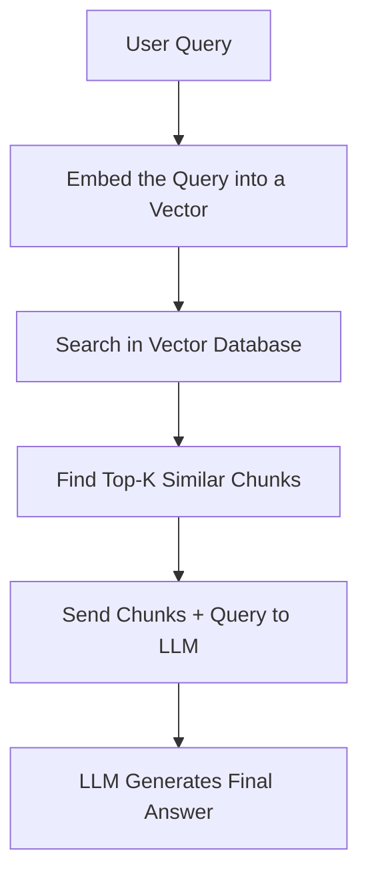

## RAG - Retriever
- It is the part of the RAG system that finds and fetches the most relevant information (Select top K most similar chunks/document) from vector store or database based on the user’s query.
- It does NOT generate answers — it fetches knowledge chunks to help the LLM generate answers later.

```
User Query → Retriever → Fetch Relevant Chunks → Pass to LLM
```

### Types of Retriever Strategies
| Strategy | Description |
|:--------:|:-----------:|
| Dense Retrieval | Use dense embeddings (vectors) and vector similarity. (default in RAG) |
| Sparse Retrieval | Use traditional keyword-based TF-IDF methods. (older approach) |
| Hybrid Retrieval | Combine both dense + sparse to cover more ground. |

> **Note**:
>- **Good Retriever = Good documents** = **Good LLM output**.
>- Retrieval is **critical** — 70% of RAG system quality depends on it.



## Augmentation
- Augmentation means combining*:
  - The user's original query  
  - The retrieved chunks  
into a single prompt that is finally sent to the **LLM** for generating the final answer.

### Augmentation - Example?
**User Query:**  
> "How to install xyz v15?"

**Retrieved Chunks:**  
- Step-by-step install guide
- System requirements
- License info

**Augmented Prompt sent to LLM:**  
```
Use the below documents to answer the question:
---
[Document 1]: Step-by-step guide to install xyz v15.
[Document 2]: System Requirements for xyz v15.
[Document 3]: Licensing Information for xyz 15.
---
Question: How to install xyz v15?
Answer:
```

### Augmentation Techniques:
| Technique | Purpose |
|:---------:|:-------:|
| Stuffing | Directly insert all retrieved chunks into one prompt. (Simple but can hit token limit.) |
| Map-Reduce | Break documents into parts, summarize separately, combine at end. (Good for large docs.) |
| Re-Ranking | If too many chunks retrieved, select the most relevant ones. |


## Metadata and Filtering
- When chunk is stored in a vector store, some extra information can be stored to each chunk.
- Example Metadata Fields:
  - Document Title
  - Section Name
  - Author
  - Date of Document
  - Tags (e.g., “Installation Guide”, “Admin Manual”)

### Why Use Metadata?
- Help to only search among chunks matching certain criteria.
- Reduce the search space before even running vector similarity.
- User gets highly relevant answers.

## Requests and Limits
### OOM Killed

## 
